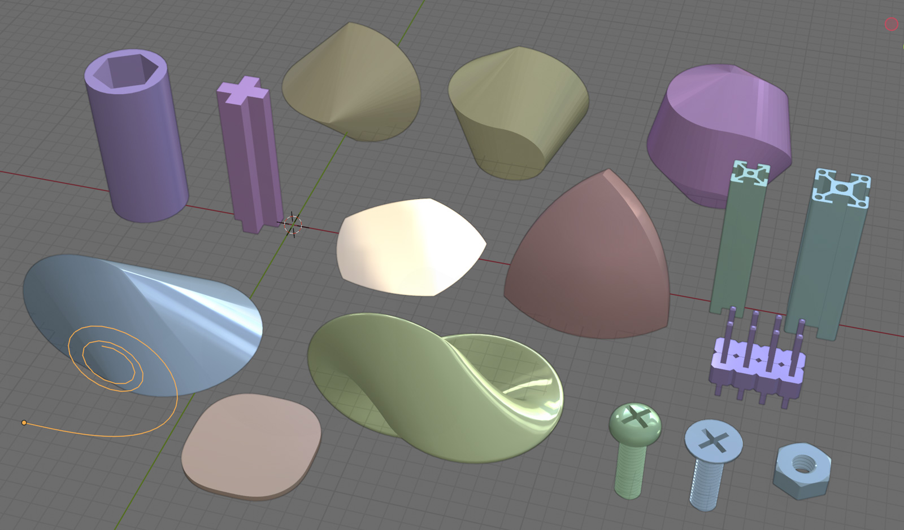
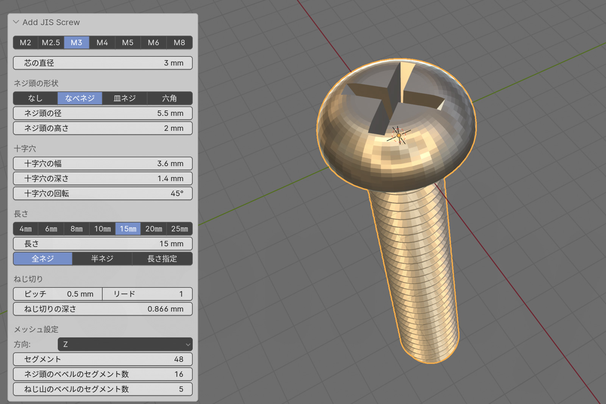

[](https://www.blender.org/)
[](https://github.com/Romly-Romly/romly_blender_addon/blob/main/LICENSE)

# romly_blender_addon

個人的に作成、使用している[Blender](https://www.blender.org/)用のスクリプトいろいろをアドオンにまとめたもの。<br>
動作確認したBlenderのバージョンは4.0です。<br>

## 含まれる機能

- メッシュ作成
	- 原点位置を設定可能な立方体([Add Box](#Add-Box))
	- 中空構造のシリンダー([Add Donut Cylinder](#add-donut-cylinder))
	- 十字架を掃引した形状([Add Cross Extrusion](#add-cross-extrusion))
	- ルーローの多角形([Add Reuleaux Polygon](#add-reuleaux-polygon))
	- ルーローの四面体([Add Reuleaux Tetrahedron](#add-reuleaux-tetrahedron))
	- スフェリコン([Add Sphericon](#add-sphericon))
	- オロイド／アンチオロイド([Add Oloid](#add-oloid))
	- クロソイド曲線([Add Clothoid Curve](#add-clothoid-curve))
	- クロソイド角丸矩形([Add Clothoid Corner Plate](#add-clothoid-corner-plate))
	- ねじ／ナット([Add JIS Screw](#add-jis-screw), [Add JIS Nut](#add-jis-nut))
	- アルミフレーム([Add Aluminum Extrusion](#add-aluminum-extrusion))
	- ピンヘッダー([Add Pin Header](#add-pin-header))
	- 3Dプリント用ナット穴([Add Nut Hole](#add-nut-hole))
- オブジェクトのコンテキストメニュー
	- すべてのモデファイアを適用([Apply All Modifiers](#apply-all-modifiers))
	- 固定距離の配列モデファイアを追加([Add Constant Offset Array Modifier](#add-constant-offset-array-modifier))
	- ウェイト制限のベベルモデファイアを追加([Add Weight Bevel Modifier](#add-weight-bevel-modifier))
	- ビューポート表示のテクスチャ／ワイヤーフレーム切り替え([Toggle Viewport Display As](#toggle-viewport-display-as))
- 編集モードの辺メニュー
	- 平面上にある辺（溶解可能な辺）を選択([Select edges on Fair Surface](#select-edges-on-fair-surface))
	- 軸に沿った辺を選択([Select edges along Axis](#select-edges-along-axis))
- オブジェクト／コレクションをSTL形式で簡単にエクスポート([Export Selection as STL](#export-selection-as-stl), [Export Collection as STL](#export-collection-as-stl))
- 言語設定を切り替えられるパネル([Language Panel](#language-panel))
- アクティブスクリプトを再読み込みして実行([Reload and Run Script](#reload-and-run-script))
- 【おまけ】blend1ファイルを再帰的に削除するPythonスクリプト([blend1_cleaner.py](#blend1_cleanerpy))


作成可能なオブジェクトの一部


## インストール方法

1. Githubの**コード**ボタンからzipファイルをダウンロード
2. Blenderの**環境設定** → **Add-ons** → **Install** でダウンロードしたzipファイルを指定
3. インストール成功するとアドオンが表示されるので、有効化

## 使い方

### Add Box

*Add Menu*(<kbd>Shift+A</kbd>) → *Romly*

オブジェクトの原点位置を指定可能な直方体を追加します。Blenderで立方体を追加するのと同じですが、標準機能だと常に原点位置が立方体中心です。<br>
自分は原点を角や底面の中心などに修正してから使うことが多いのでスクリプトにまとめました。<br>
UVマップは無いのでご注意下さい。<br>

-----

### Add Donut Cylinder

*Add Menu*(<kbd>Shift+A</kbd>) → *Romly*

中空になっている円柱を追加します。直径／内径の指定の他、直径または内径と肉厚での指定もできます。さらにオブジェクトの原点を最初から底辺や上辺にできるので長さ指定も楽ちん。セグメント数は外側と内側で別々に設定できるので、六角形の円柱に丸い穴というような形状も作れます。<br>
これは[#軸の秤](https://twitter.com/search?q=%23%E8%BB%B8%E3%81%AE%E7%A7%A4&f=live)みたいもののケースをBlenderで作っていると、ネジ穴周りの設計で非常によく使う形状なのでスクリプトにまとめました。

-----

### Add Cross Extrusion

*Add Menu*(<kbd>Shift+A</kbd>) → *Romly*


XY平面に描いた十字をZ方向に掃引した形状を作成します。十字は横方向、縦方向それぞれの棒の太さと長さを個別に設定できます。

こんな形何に使うんだって感じですが、昔Cherry MX対応のキーキャップを3Dプリントで作る時に、ソケット部分を削る形状を作るのに使ってました。

-----

### Add Reuleaux Polygon

*Add Menu(<kbd>Shift+A</kbd>) → *Romly*


XY平面にルーローの多角形を作成します。正しくルーローの多角形になるのは辺の数が奇数の場合のみで、偶数の正多角形の時は反対側の辺の中点を中心とする円弧でそれっぽい形にしているだけです。

円弧部のセグメント数を指定でき、1にすると円弧無しの正多角形になります。

-----

### Add Reuleaux Tetrahedron

*Add Menu(<kbd>Shift+A</kbd>) → *Romly*


ルーローの四面体を作成します。UV球またはICO球の共通部分を使って作成する方法と、頂点を計算して作成する方法を選択できます。前者の場合、メッシュの分割数が少ないと四面体の角が出ず形状が破綻してしまいます。
いずれの作成方法でも、分割数を最小にすれば通常の正四面体を作れます。

-----

### Add Sphericon

*Add Menu(<kbd>Shift+A</kbd>) → *Romly*


スフェリコン形状のメッシュを作成します。一般的な正方形の回転体から作るスフェリコンの他、任意の多角形から作成することが可能で、左右のずらし量も指定できます。

-----

### Add Oloid

*Add Menu(<kbd>Shift+A</kbd>) → *Romly*


オロイドまたはアンチオロイド形状のメッシュを作成します。円部分の頂点数を指定できますが、一部はオロイドを構築する際に削除されるため、実際の頂点数は指定した数より少なくなります。オロイドのみ、UVマップ展開済みです。

-----

### Add Clothoid Curve

*Add Menu(<kbd>Shift+A</kbd>) → *Romly*


クロソイド曲線（またはオイラー螺旋、コルニュ螺旋）と呼ばれる、曲率が一定で変わっていく曲線のメッシュを作成します。メッシュと言っても曲線なので頂点群とそれらを結ぶ辺のみで、面はありません。

曲線半径、曲線長、クロソイドパラメーターのうちいずれか2つを指定して曲線の形状を決め、それらをいくつの頂点で再現するか指定できます。頂点数が少ないと当然ガタガタのカーブになってしまいます。足りない脳みそでなんとか曲線のアルゴリズムを再現したので、それぞれのパラメータについては誤りがあったらすいません。つくづく数学をもっとちゃんと勉強しとけば良かったと思いました。

-----

### Add Clothoid Corner Plate

*Add Menu(<kbd>Shift+A</kbd>) → *Romly*


角丸の矩形メッシュを追加しますが、ベベルモデファイアなどを使った角丸と違い、クロソイド曲線と円弧を使った角丸になっています。直線部分から徐々に曲率を上げていくので非常に滑らかな角丸になります。確か、iPhoneはアプリのアイコンや本体にこの形状を使っていたハズです。あとは道路のカーブにも必ず使われるやつです。
上のスクリーンショットでは、黒い線の通常の角丸に対し、より滑らかなカーブになっていることがわかります。

ただし、曲線半径、曲線長、クロソイドパラメーターのいずれか2つを使って角丸具合を指定するため、普通の角丸のように大きさを直接指定できないので若干使いにくいです。現在の設定で角丸部分全体がどれくらいの大きさになるかはオペレーターパネルに表示されます。通常はクロソイド曲線 → 円弧 → クロソイド曲線という流れになりますが、クロソイド曲線の設定によって曲線部分のみで45度に達してしまった時は円弧を挟まずに点対称なクロソイド曲線2つで構成される角丸となります。

矩形としてはXY方向の大きさと厚みを指定できます。大きさは角丸部分を含む全体の大きさを指定します。クロソイド曲線の設定によっては角丸部分の大きさが矩形の大きさを超えてしまう事がありますが、その時は角丸部分が矩形の大きさに収まるよう縮小されます（角丸部分の実際の大きさとは別に、縮小された大きさも表示されるようになります）。

-----

### Add JIS Screw

*Add Menu(<kbd>Shift+A</kbd>) → *Romly*



JIS規格のねじを作成します。なべネジや皿ネジ、ネジ頭のないねじ切りだけの円柱も作れます。M2〜M8のサイズを選択すれば、自動的に適切なサイズに設定されますが、各部寸法を細かく設定もできます。ねじ切りについてはピッチやリードも設定できます。

M5以上くらいのサイズであれば、0.4mmノズルのFDM 3Dプリンタで出力してもそれなりに動作するネジになります。
**ただし、そのままのサイズだとネジとナットのねじ切りに一切の遊びがないので、太さを調整する必要があります。**

-----

### Add JIS Nut

*Add Menu(<kbd>Shift+A</kbd>) → *Romly*


JIS規格のナットを作成します。ネジ同様、M2〜M8のサイズを選べる他、サイズを細かく調整することも出来、上面、底面の面取りの有無も選べます。

**Add JIS Screwで作ったネジと合わせて3Dプリンタで出力して使う時は、ねじ切りの寸法を調整して遊びを作るのを忘れないようにして下さい。**

-----

### Add Aluminum Extrusion

*Add Menu(<kbd>Shift+A</kbd>) → *Romly*


アルミフレーム形状のメッシュを作成します。パラメーターをいろいろ変更できるので存在しないアルミフレームの形状も作れてしまいますが、UI上に表示されている2020, 2040, 2060, 3030, 3060, 3090, 6090は比較的正確な大きさになると思います。CADのような正確な形状ではなく、ケース作成時などにあたりを取るためのオブジェクトという目的なのでご了承下さい。

-----

### Add Pin Header

*Add Menu*(<kbd>Shift+A</kbd>) → *Romly*


ピンヘッダーを追加します。ピン数とピンのピッチを2.54mm、2.00mm、1.27mmから選択できます。ピン数はArrayモデファイアになっています。オブジェクトの原点は1番ピンの中心、PCBと接する点になっています。<br>
ピンの具体的な長さやブロック部分の大きさは一般的なものになっていると思いますが、必要に応じて生成時に調整可能です。マテリアルは未設定ですが、ピン部分とブロック部分は繋がっていないので塗り分けは簡単かと。

L型のも作れるといいんだけどとりあえずストレートのみです。

これも軸の秤でケースを設計している時にやたら使うのでスクリプトにまとめました。ピンヘッダー自体は単純な形状なのでキューブを2つ組み合わせればすぐできるのですが、サイズ指定とかいちいち手間だったものがスクリプトにすると一発で作れて楽ちんです。

-----

### Add Nut Hole

*Add Menu*(<kbd>Shift+A</kbd>) → *Romly*

3Dプリントで印刷方向に対して下からナットを入れる時の穴を作るためのブーリアンモデファイア用オブジェクトを作成します。サポート無しで空中に作れるよう、犠牲レイヤーを使った方法とブリッジを使った方法のための形状を作成できます。
また、ネジ穴、ナット穴の周囲にシームを避けるためのスリットや、一層目を一筆書きにするためのスリットも作れます。機能を呼び出す時に選択されているオブジェクトがあれば、そのオブジェクトに対してブーリアンモデファイアを設定済みの状態にも出来ます。3Dカーソルをナット穴を開けたいオブジェクトの表面に設定してから機能を呼び出すと正しく穴を作れます。


作成できるオブジェクト（左）と、ブーリアンモデファイアで削った様子（右）。

<video controls>
	<source src="images/add_nut_hole_slice.mov" type="video/mp4">
</video>
穴を開けたオブジェクトをスライスした様子。積層ピッチとレイヤーの厚みを適切に設定すれば犠牲レイヤー／ブリッジを使ってサポート無しで空中にネジ穴が作れます。

-----

### Apply All Modifiers

*Object Context Menu*（オブジェクトを右クリック） → *Romly Tools*

すべてのモデファイアをまとめて適用します。そのまま。<br>
なんで標準機能にないんだろう？

-----

### Add Constant Offset Array Modifier

*Object Context Menu*（オブジェクトを右クリック） → *Romly Tools*

Relative OffsetではなくConstant Offsetを設定した状態のArrayモデファイアを追加します。<br>
自分の用途的にはRelative Offsetを指定することは極めて稀で、毎回毎回Constant Offsetにチェックを入れ直してオフセット距離を指定するのが面倒なのでスクリプトにまとめました。

-----

### Add Weight Bevel Modifier

*Object Context Menu*（オブジェクトを右クリック） → *Romly Tools*

Limit MethodにWeightを設定済みのベベルモデファイアを追加します。自分の場合、ベベルモデファイアは九割方ウェイト制限設定で使うので、ディフォルトのNoneからいちいち変更するのが面倒くさいので機能としてまとめました。

-----

### Toggle Viewport Display As

*Object Context Menu*（オブジェクトを右クリック） → *Romly Tools*

オブジェクトの表示をテクスチャ ←→ ワイヤーフレームで切り替える機能です。Blenderのオブジェクトプロパティ → Viewport Display → Display As で Textured / Wired を設定するのと同じです。

自分の場合はブーリアンモデファイアのツールオブジェクトを見やすいようワイヤーフレーム表示にすることが多いのですが、あとから編集する時はソリッドないしテクスチャ表示に戻す必要があり、頻繁に切り替えるのにいちいちオブジェクトプロパティパネルを表示しなくても切り替えられるようにしたかったので、右クリックメニューにこの機能を追加しました。地味に便利です。

-----

### Export Collection as STL

*Collection Menu*（コレクションを右クリック） → *Romly Tools*

コレクション内のメッシュをSTLファイルとして出力します。出力されるファイル名は `(blenderファイル名) - (コレクション名).stl` で、blenderファイルと同じフォルダに保存されます。このため、**編集中のファイルが保存されていないと（ファイル名が無いと）エラーになります。また、ファイル名に使えない文字をコレクション名に使っていたりするとエラーになるかもしれません。**<br>
サブコレクションも出力されますが、レイヤービューから除外されているコレクションは含まれません。

これは3Dプリントする時にスライサーに持っていくSTLファイルを出力するのに使っています。blenderで機械的な3Dプリント品を作る場合、CADソフトと違って複数のオブジェクトを組み合わせて形作ることが多いかと思います。自分の場合は出力するパーツごとにコレクションを作って、その中にそのパーツを構成するメッシュを格納しておき、このスクリプトでSTLを出力、スライサーに持っていくという流れで印刷してます。<br>
いちいちSTLファイルに含めるメッシュを選択する必要が無く、STLをエクスポートするときのダイアログも飛ばせるのでそれなりに便利です。<br>
また、レイヤービューから除外されているコレクションは対象外になるので、出力したくないメッシュ（ブーリアンモデファイアの演算対象など）は子コレクション内に格納し、出力時は*レイヤービューから除外*のチェックをしておくと出力には含まれず、また3Dビュー上でもブーリアンの結果のみ確認できるので便利です。

-----

### Export Selection as STL

*Object Menu*（アウトライナー上でオブジェクトを右クリック） → *Romly Tools*

選択されているオブジェクトをSTLファイルとして出力します。出力されるファイル名は `(blenderファイル名) - (アクティブなオブジェクト名).stl` で、blenderファイルと同じフォルダに保存されます。このため、 *Export Collection as STL* と同様、**編集中のファイルが保存されていないと（ファイル名が無いと）エラーになります。**<br>
*Export Collection as STL* とほとんど同じですが、単体オブジェクトや、選択範囲をサクッとSTLファイルにエクスポートしたい時のために作りました。

-----

### Select Edges on Fair Surface

**平面上にある辺を選択**

*Edge Menu*（編集モード）
*Edit Mesh Context Menu*（編集モード・辺選択時に右クリック）


編集中のメッシュの、平面上にある辺、つまり溶解しても影響がない辺をまとめて選択できます。STLファイルなどをインポートした時に、無駄な辺を整理するのに使えると思います。blenderの標準機能でありそうなのですが、見つけられないので作っちゃいました。

処理としてはすべての辺について、その辺を共有する2つの面の法線を求め、その内積が閾値の角度以下なら辺を選択します。閾値は変更可能で、0度なら平面にある辺のみを選択しますが、大きくすることで平面ではない面の辺も選択できるようになります。

-----

### Select Edges along Axis

**軸に沿った辺を選択**

*Edge Menu*（編集モード）
*Edit Mesh Context Menu*（編集モード・辺選択時に右クリック）

編集中のメッシュの、XYZ各軸に沿った辺をまとめて選択します。例えば、立方体の縦方向の縁だけ選択してベベルを設定したいなどの用途に使えるかなと思います。『[平面上にある面を選択](#select-edges-on-fair-surface)』同様、閾値角度を変更できます。

-----

### Language Panel


サイドパネルのViewタブに『言語』というパネルが追加され、日本語、英語、フランス語、スペイン語、アラビア語、簡体字（4.1以降のみ）をボタン一つで切り替えられるようになります。また、言語設定の影響範囲を設定するチェックボックスも表示されます。

アドオンを英語対応するにあたって、デバッグで頻繁に言語設定を切り替える必要に迫られたのと、4.1から設定画面の言語ドロップダウンが1列になってしまい、非常に選択しづらくなったので作りました。日本語と英語以外の選択に関しては特に何も考えてなくて、デバッグ用に大きく変わりそうな言語をテキトーに選んだだけです。

おまけでblenderのバージョンと編集中のファイルのバージョンを表示します。


-----

### Reload and Run Script

**再読み込みして実行**

*Text Editor Context Menu*（テキストエディターで右クリック） → Reload and Run Script


Blenderのテキストエディターに表示されているアクティブスクリプトに外部からの変更があった場合に再読み込みし、さらにスクリプトを実行します。
Blenderの標準機能で *ディスクから再読み込み* → *スクリプト実行* するのと全く変わりませんが、アドオン開発中は最も頻繁に繰り返す流れなのでメニューにまとめました。


-----


## blend1_cleaner.py

【おまけ】blend1ファイルを再帰的に削除するPythonスクリプト

`extra/blend1_cleaner.py`

指定されたディレクトリ以下にある`*.blend1`ファイルを再帰的に検索し、一括で削除するPythonスクリプトです。[Send2Trash](https://pypi.org/project/Send2Trash/)モジュールがインストールされている環境であれば、削除せずにゴミ箱に移動することもできます。

**ファイルを削除する機能を持つスクリプトです。バグのために予期せぬファイルを削除してしまうことがあるかもしれません。当方は一切責任を負いかねます。了承の上自己責任でご利用下さい。**


### 使い方

```
python blend1_cleaner.py "(検索を開始するディレクトリ)" [-d] [-h]
```

#### オプション

##### `-d, --delete`

ファイルをゴミ箱に移動せず、完全に削除する場合に指定します。Send2Trashモジュールがインストールされていない環境では常に完全に削除（`-d`を指定した状態）しかできません。

##### `-h, --help`

ヘルプを表示します。


### 【オプション】send2trashのインストール

```
pip install Send2Trash
```